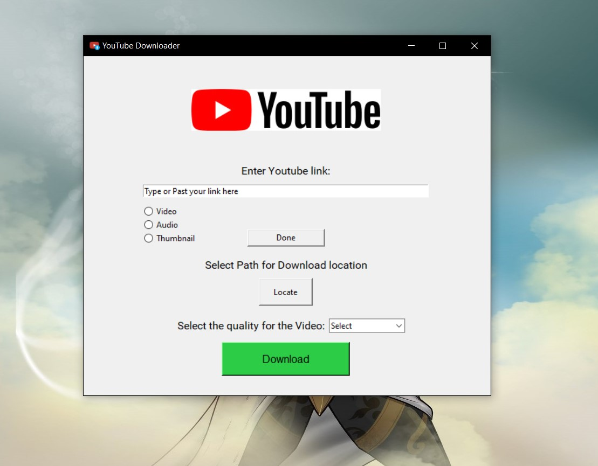

# YouTube Downloader

A simple desktop application to download videos, audio, or thumbnails from YouTube. The application provides an intuitive interface that allows users to input a YouTube URL, select the type of media they want to download, and choose the desired quality.

## Features

- Download YouTube videos in various qualities (1080p, 720p, 480p, etc.).
- Extract and download audio from YouTube videos in mp4 format.
- Download YouTube video thumbnails.
- User-friendly interface with easy navigation.
- Allows users to choose the download location.

## Requirements

- `Python` 3.x
- `pytube` library
- `tkinter` library
- `wget` library

Install the required libraries using pip:

```bash
pip install pytube wget
```

## How to Use

1. **Clone the repository:**

```bash
git clone https://github.com/sahilsnghai/Youtube-downloader
cd Youtube-downloader
```

2. **Run the application:**

```bash
python Youtube-downloader.py
```

3. **Enter the YouTube URL:**

   In the text field provided, enter the URL of the YouTube video you want to download. For example:
   
   ```
   https://www.youtube.com/watch?v=ZgMw__KdjiI
   ```

4. **Choose the type of download:**

   Select from the available options:
   - **Video**: Download the video with the chosen resolution (1080p, 720p, 360p, etc.).
   - **Audio**: Download the audio in mp4 format.
   - **Thumbnail**: Download the video's thumbnail.

5. **Select the quality:**

   If you chose to download a video or audio, select the desired quality from the dropdown menu.

6. **Select the download location:**

   Click the "Locate" button to choose where you want to save the downloaded file. By default, it will be saved in the Downloads folder.

7. **Download:**

   Click the "Download" button. The progress will be displayed, and a confirmation message will appear when the download is complete.

## Installation

You can also install the YouTube Downloader by downloading and installing the executable file:

1. **Download the executable:**

   Download the `youtube-downloader.exe` file from the [releases page](https://github.com/sahilsnghai/Youtube-downloader/releases).

2. **Install the application:**

   Run the `youtube-downloader.exe` file and follow the installation instructions.

3. **Run the application:**

   After installation, you can launch the YouTube Downloader from the start menu or desktop shortcut.

## Screenshots



## License

This project is licensed under the MIT License. See the [LICENSE](LICENSE) file for details.

## Acknowledgements

- [pytube](https://pytube.io/en/latest/) - A lightweight, dependency-free Python library for downloading YouTube videos.
